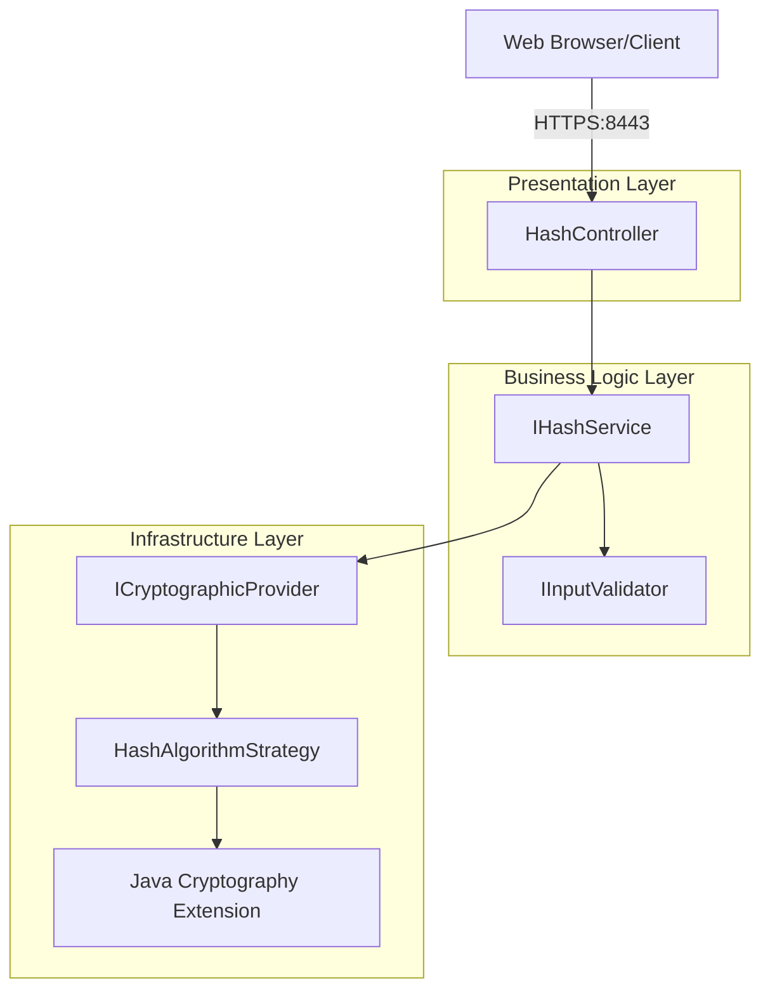

# ARCHITECTURE.md

## Design Philosophy & Architectural Patterns

### Clean Architecture Implementation

This project follows **Clean Architecture** principles with clear separation of concerns, implementing **SOLID principles** throughout. The architecture evolves from the provided educational skeleton to a professional, maintainable codebase that demonstrates enterprise-level security practices.



### Layer Responsibilities

**Presentation Layer (Controller)**
- Handles HTTP requests and responses
- Manages content negotiation (HTML/JSON)
- Performs basic request validation
- Formats responses appropriately

**Business Logic Layer (Service)**
- Implements core hash generation logic
- Orchestrates validation and cryptographic operations
- Manages business rules and constraints
- Handles algorithm selection logic

**Infrastructure Layer (Provider/Strategy)**
- Abstracts cryptographic operations
- Implements specific hash algorithms
- Manages MessageDigest instances
- Handles low-level security operations

## Core Interfaces & Components

### Service Layer Interface Design

```java
public interface IHashService {
    /**
     * Computes cryptographic hash for given input using specified algorithm
     * @param input The data to hash (student name + additional data)
     * @param algorithm The hash algorithm to use (SHA-256, SHA-3-256, etc.)
     * @return HashResult containing original data, algorithm, and hex hash
     * @throws CryptographicException if hash computation fails
     */
    HashResult computeHash(String input, String algorithm) throws CryptographicException;

    /**
     * Gets information about supported algorithms
     * @return List of supported algorithm information
     */
    List<AlgorithmInfo> getSupportedAlgorithms();

    /**
     * Validates if an algorithm is secure and supported
     * @param algorithm Algorithm name to validate
     * @return true if algorithm is secure and supported
     */
    boolean isAlgorithmSecure(String algorithm);
}
```

### Cryptographic Provider Interface

```java
public interface ICryptographicProvider {
    /**
     * Creates MessageDigest instance for specified algorithm
     * @param algorithm Algorithm name (must be secure)
     * @return Configured MessageDigest instance
     * @throws CryptographicException if algorithm is unsupported or insecure
     */
    MessageDigest createDigest(String algorithm) throws CryptographicException;

    /**
     * Converts byte array to hexadecimal string representation
     * @param bytes Byte array to convert
     * @return Lowercase hexadecimal string
     */
    String bytesToHex(byte[] bytes);

    /**
     * Gets list of secure, supported algorithms
     * @return Set of algorithm names that are cryptographically secure
     */
    Set<String> getSecureAlgorithms();
}
```

### Strategy Pattern Implementation

```java
public interface HashAlgorithmStrategy {
    /**
     * Computes hash using this strategy's specific algorithm
     * @param input Data to hash
     * @return Computed hash as byte array
     * @throws CryptographicException if computation fails
     */
    byte[] computeHash(String input) throws CryptographicException;

    /**
     * Gets the algorithm name for this strategy
     * @return Algorithm name (e.g., "SHA-256")
     */
    String getAlgorithmName();

    /**
     * Indicates if this algorithm is cryptographically secure
     * @return true if algorithm is collision-resistant and secure
     */
    boolean isSecure();

    /**
     * Gets performance characteristics of this algorithm
     * @return Performance rating (FAST, MEDIUM, SLOW)
     */
    PerformanceRating getPerformanceRating();
}
```

## Project Structure Organization

### Enhanced Package Structure

```
ssl-server/
├── src/main/java/com/snhu/sslserver/
│   ├── ServerApplication.java              # Main application entry point
│   ├── controller/                         # Presentation layer
│   │   └── HashController.java            # REST endpoint handling
│   ├── service/                           # Business logic layer
│   │   ├── IHashService.java              # Hash service interface
│   │   ├── HashServiceImpl.java           # Hash service implementation
│   │   ├── IInputValidator.java           # Validation interface
│   │   └── SecurityInputValidator.java    # Security validation impl
│   ├── provider/                          # Infrastructure layer
│   │   ├── ICryptographicProvider.java    # Crypto interface
│   │   └── CryptographicProvider.java     # Crypto implementation
│   ├── strategy/                          # Algorithm strategies
│   │   ├── HashAlgorithmStrategy.java     # Strategy interface
│   │   ├── SHA256Strategy.java            # SHA-256 implementation
│   │   └── SHA3Strategy.java              # SHA-3 implementation
│   ├── model/                             # Data models
│   │   ├── HashResult.java                # Hash operation result
│   │   ├── AlgorithmInfo.java             # Algorithm metadata
│   │   └── ValidationResult.java          # Validation response
│   ├── factory/                           # Factory patterns
│   │   └── HashAlgorithmFactory.java      # Algorithm factory
│   ├── util/                              # Utility classes
│   │   ├── CryptographicUtils.java        # Crypto utilities
│   │   └── ResponseFormatter.java         # Response formatting
│   ├── exception/                         # Custom exceptions
│   │   ├── CryptographicException.java    # Crypto errors
│   │   └── SecurityException.java         # Security violations
│   └── config/                            # Configuration classes
│       └── SecurityConfig.java            # Security configuration
```

### Naming Conventions & Standards

#### Interface Naming Pattern
```java
// Interfaces use 'I' prefix for clarity
public interface IHashService { }
public interface IInputValidator { }
public interface ICryptographicProvider { }

// Strategy interfaces use descriptive names
public interface HashAlgorithmStrategy { }
```

#### Implementation Naming Pattern
```java
// Implementations use descriptive, purpose-driven names
public class HashServiceImpl implements IHashService { }
public class SecurityInputValidator implements IInputValidator { }
public class CryptographicProvider implements ICryptographicProvider { }

// Strategy implementations include algorithm name
public class SHA256Strategy implements HashAlgorithmStrategy { }
public class SHA3_256Strategy implements HashAlgorithmStrategy { }
```

## Data Models & Value Objects

### HashResult Model

```java
public class HashResult {
    private final String originalData;
    private final String algorithm;
    private final String hexHash;
    private final Instant timestamp;
    private final long computationTimeMs;

    // Builder pattern for construction
    public static class Builder {
        // Builder implementation
    }

    // Immutable getters, equals, hashCode, toString
}
```

### AlgorithmInfo Model

```java
public class AlgorithmInfo {
    private final String name;
    private final boolean secure;
    private final PerformanceRating performance;
    private final String description;
    private final Set<String> aliases;

    // Constructor, getters, equals, hashCode, toString
}
```

### Custom Exception Hierarchy

```java
public class CryptographicException extends Exception {
    private final ErrorCode errorCode;
    private final String userMessage;

    public enum ErrorCode {
        ALGORITHM_NOT_SUPPORTED,
        ALGORITHM_INSECURE,
        COMPUTATION_FAILED,
        INPUT_VALIDATION_FAILED,
        CONFIGURATION_ERROR
    }
}
```

## Design Patterns Implementation

### Strategy Pattern for Algorithm Selection

```java
@Component
public class HashAlgorithmFactory {
    private final Map<String, HashAlgorithmStrategy> strategies;

    @Autowired
    public HashAlgorithmFactory(List<HashAlgorithmStrategy> strategyList) {
        this.strategies = strategyList.stream()
            .collect(Collectors.toMap(
                strategy -> strategy.getAlgorithmName().toUpperCase(),
                strategy -> strategy
            ));
    }

    public HashAlgorithmStrategy createStrategy(String algorithmName) {
        HashAlgorithmStrategy strategy = strategies.get(algorithmName.toUpperCase());
        if (strategy == null) {
            throw new IllegalArgumentException("Unsupported algorithm: " + algorithmName);
        }
        return strategy;
    }
}
```

### Factory Pattern for Object Creation

```java
@Component
public class MessageDigestFactory {
    private static final Set<String> SECURE_ALGORITHMS = Set.of(
        "SHA-256", "SHA-384", "SHA-512",
        "SHA-3-256", "SHA-3-384", "SHA-3-512"
    );

    public MessageDigest createSecureDigest(String algorithm) throws CryptographicException {
        if (!SECURE_ALGORITHMS.contains(algorithm)) {
            throw new CryptographicException("Algorithm not secure: " + algorithm);
        }
        
        try {
            return MessageDigest.getInstance(algorithm);
        } catch (NoSuchAlgorithmException e) {
            throw new CryptographicException("Algorithm not available: " + algorithm, e);
        }
    }
}
```

### Template Method Pattern

```java
public abstract class AbstractHashProcessor {
    public final ProcessedHashResult processHash(String input, String algorithm) {
        // Template method defines workflow
        String sanitized = validateAndSanitize(input);
        String algorithmValidated = validateAlgorithm(algorithm);
        byte[] hashBytes = computeHashBytes(sanitized, algorithmValidated);
        String hexHash = bytesToHex(hashBytes);
        return createResult(sanitized, algorithmValidated, hexHash);
    }

    // Abstract methods for subclasses to implement
    protected abstract String validateAndSanitize(String input);
    protected abstract String validateAlgorithm(String algorithm);
    protected abstract byte[] computeHashBytes(String input, String algorithm);
    
    // Common implementations
    protected String bytesToHex(byte[] bytes) { /* implementation */ }
    protected ProcessedHashResult createResult(String input, String algorithm, String hash) { /* implementation */ }
}
```

## REST Controller Architecture

### Content Negotiation Implementation

```java
@RestController
@RequestMapping("/api/v1")
@Validated
@Slf4j
public class HashController {

    private final IHashService hashService;
    private final IInputValidator validator;

    @GetMapping(value = "/hash", produces = {MediaType.TEXT_HTML_VALUE, MediaType.APPLICATION_JSON_VALUE})
    public ResponseEntity<?> generateHash(
            @RequestParam(defaultValue = "SHA-256") String algorithm,
            @RequestParam(defaultValue = "") String data,
            @RequestHeader(value = "Accept", defaultValue = "text/html") String acceptHeader) {

        try {
            ValidationResult validation = validator.validateAlgorithm(algorithm);
            if (!validation.isValid()) {
                return createErrorResponse(validation.getErrors(), HttpStatus.BAD_REQUEST);
            }

            HashResult result = hashService.computeHash(data, algorithm);

            if (acceptHeader.contains("application/json")) {
                return ResponseEntity.ok(createJsonResponse(result));
            } else {
                return ResponseEntity.ok()
                    .contentType(MediaType.TEXT_HTML)
                    .body(createHtmlResponse(result));
            }

        } catch (CryptographicException e) {
            return handleCryptographicException(e);
        }
    }
}
```

## Configuration Management

### Type-Safe Configuration Properties

```java
@ConfigurationProperties(prefix = "app.hash")
@Component
@Validated
public class HashConfiguration {

    @NotBlank
    private String defaultAlgorithm = "SHA-256";

    @Min(1) @Max(10000)
    private int maxInputLength = 1000;

    @NotEmpty
    private Set<String> allowedAlgorithms = Set.of("SHA-256", "SHA-3-256", "SHA-512");

    private boolean rejectDeprecatedAlgorithms = true;

    // Getters and setters with validation
}
```

### SSL Configuration Structure

```properties
# SSL/TLS Security Configuration
server.port=8443
server.ssl.key-store-type=PKCS12
server.ssl.key-store=classpath:keystore.p12
server.ssl.key-alias=tomcat
server.ssl.key-store-password=snhu4321
server.ssl.enabled=true

# Security Headers and Protocols
server.ssl.ciphers=TLS_ECDHE_RSA_WITH_AES_256_GCM_SHA384,TLS_ECDHE_RSA_WITH_AES_128_GCM_SHA256
server.ssl.protocol=TLS
server.ssl.enabled-protocols=TLSv1.2,TLSv1.3
```

## Testing Architecture

### Test Structure Organization

```
src/test/java/com/snhu/sslserver/
├── controller/                        # Presentation layer tests
│   └── HashControllerTest.java
├── service/                          # Business logic tests
│   ├── HashServiceTest.java
│   └── InputValidatorTest.java
├── provider/                         # Infrastructure tests
│   └── CryptographicProviderTest.java
├── strategy/                         # Strategy pattern tests
│   ├── SHA256StrategyTest.java
│   └── SHA3StrategyTest.java
├── integration/                      # Integration tests
│   └── HashEndpointIntegrationTest.java
└── util/                            # Utility tests
    └── CryptographicUtilsTest.java
```

### Testing Patterns

```java
// Unit Test Example with Mocking
@ExtendWith(MockitoExtension.class)
class HashServiceImplTest {
    @Mock private ICryptographicProvider cryptoProvider;
    @Mock private IInputValidator validator;
    @InjectMocks private HashServiceImpl hashService;

    @Test
    @DisplayName("Should compute hash successfully with valid input")
    void shouldComputeHashSuccessfully() {
        // Given
        String input = "test data";
        String algorithm = "SHA-256";
        
        // When & Then
        // Test implementation
    }
}

// Integration Test Example
@SpringBootTest(webEnvironment = SpringBootTest.WebEnvironment.RANDOM_PORT)
class HashControllerIntegrationTest {
    @Autowired private TestRestTemplate restTemplate;

    @Test
    @DisplayName("Should return HTML response for browser requests")
    void shouldReturnHtmlResponseForBrowserRequests() {
        // Test complete HTTP flow with SSL
    }
}
```

## Architectural Decision Records

### Why Clean Architecture?
- **Separation of Concerns**: Clear boundaries between presentation, business logic, and infrastructure
- **Testability**: Easy to unit test business logic without external dependencies
- **Maintainability**: Changes in one layer don't affect others
- **Educational Value**: Demonstrates professional software architecture patterns

### Why Strategy Pattern for Algorithms?
- **Open/Closed Principle**: Easy to add new algorithms without modifying existing code
- **Algorithm Abstraction**: Business logic doesn't depend on specific algorithm implementations
- **Runtime Selection**: Algorithms can be selected dynamically based on requirements
- **Security Validation**: Each strategy can enforce its own security characteristics

### Why Interface Segregation?
- **Single Responsibility**: Each interface serves a specific client need
- **Dependency Minimization**: Clients only depend on methods they actually use
- **Testing Support**: Easy to create focused mocks for unit testing
- **Evolution Support**: Interfaces can evolve independently

### Why Constructor Injection?
- **Immutability**: Dependencies are final and cannot be changed after construction
- **Fail-Fast**: Missing dependencies cause immediate failure at startup
- **Testability**: Easy to provide test doubles through constructor
- **Explicit Dependencies**: Makes component requirements clear and visible

This architectural approach provides a solid foundation for both educational objectives and potential production deployment, demonstrating enterprise-level patterns while maintaining focus on security and maintainability.