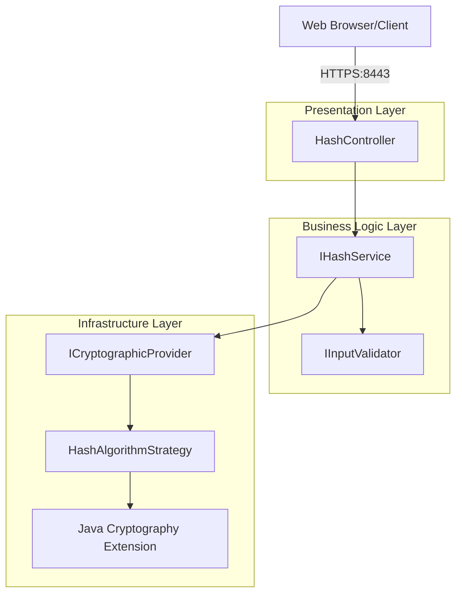

# Design Document

## Overview

The Checksum Verification System is designed as a secure, Spring Boot-based web application that provides cryptographic hash generation services through a RESTful API. The system follows Clean Architecture principles with clear separation of concerns, implementing the Strategy pattern for algorithm selection and adhering to SOLID principles throughout.

The architecture evolves from the provided educational skeleton to a professional, maintainable codebase that demonstrates enterprise-level security practices while meeting CS305 academic requirements.

## Architecture

### High-Level Architecture



### Layered Architecture Design

**Presentation Layer (Controller)**
- Handles HTTP requests and responses
- Manages content negotiation (HTML/JSON)
- Performs basic request validation
- Formats responses appropriately

**Business Logic Layer (Service)**
- Implements core hash generation logic
- Orchestrates validation and cryptographic operations
- Manages business rules and constraints
- Handles algorithm selection logic

**Infrastructure Layer (Provider/Strategy)**
- Abstracts cryptographic operations
- Implements specific hash algorithms
- Manages MessageDigest instances
- Handles low-level security operations

## Components and Interfaces

### Core Service Interface

```java
public interface IHashService {
    /**
     * Computes cryptographic hash for given input using specified algorithm
     * @param input The data to hash (student name + additional data)
     * @param algorithm The hash algorithm to use (SHA-256, SHA-3-256, etc.)
     * @return HashResult containing original data, algorithm, and hex hash
     * @throws CryptographicException if hash computation fails
     */
    HashResult computeHash(String input, String algorithm) throws CryptographicException;

    /**
     * Gets information about supported algorithms
     * @return List of supported algorithm information
     */
    List<AlgorithmInfo> getSupportedAlgorithms();

    /**
     * Validates if an algorithm is secure and supported
     * @param algorithm Algorithm name to validate
     * @return true if algorithm is secure and supported
     */
    boolean isAlgorithmSecure(String algorithm);
}
```

### Cryptographic Provider Interface

```java
public interface ICryptographicProvider {
    /**
     * Creates MessageDigest instance for specified algorithm
     * @param algorithm Algorithm name (must be secure)
     * @return Configured MessageDigest instance
     * @throws CryptographicException if algorithm is unsupported or insecure
     */
    MessageDigest createDigest(String algorithm) throws CryptographicException;

    /**
     * Converts byte array to hexadecimal string representation
     * @param bytes Byte array to convert
     * @return Lowercase hexadecimal string
     */
    String bytesToHex(byte[] bytes);

    /**
     * Gets list of secure, supported algorithms
     * @return Set of algorithm names that are cryptographically secure
     */
    Set<String> getSecureAlgorithms();
}
```

### Hash Algorithm Strategy Pattern

```java
public interface HashAlgorithmStrategy {
    /**
     * Computes hash using this strategy's specific algorithm
     * @param input Data to hash
     * @return Computed hash as byte array
     * @throws CryptographicException if computation fails
     */
    byte[] computeHash(String input) throws CryptographicException;

    /**
     * Gets the algorithm name for this strategy
     * @return Algorithm name (e.g., "SHA-256")
     */
    String getAlgorithmName();

    /**
     * Indicates if this algorithm is cryptographically secure
     * @return true if algorithm is collision-resistant and secure
     */
    boolean isSecure();

    /**
     * Gets performance characteristics of this algorithm
     * @return Performance rating (FAST, MEDIUM, SLOW)
     */
    PerformanceRating getPerformanceRating();
}
```

### Input Validation Interface

```java
public interface IInputValidator {
    /**
     * Validates and sanitizes input data for hash computation
     * @param input Raw input data
     * @return ValidationResult with sanitized data or error details
     */
    ValidationResult validateAndSanitize(String input);

    /**
     * Validates algorithm name for security and support
     * @param algorithm Algorithm name to validate
     * @return ValidationResult indicating if algorithm is acceptable
     */
    ValidationResult validateAlgorithm(String algorithm);
}
```

### REST Controller Design

```java
@RestController
@RequestMapping("/api/v1")
@Validated
@Slf4j
public class HashController {

    private final IHashService hashService;
    private final IInputValidator validator;

    @GetMapping(value = "/hash", produces = {MediaType.TEXT_HTML_VALUE, MediaType.APPLICATION_JSON_VALUE})
    public ResponseEntity<?> generateHash(
            @RequestParam(defaultValue = "SHA-256") String algorithm,
            @RequestHeader(value = "Accept", defaultValue = "text/html") String acceptHeader) {

        // Implementation handles content negotiation and response formatting
    }
}
```

## Data Models

### HashResult Model

```java
public class HashResult {
    private final String originalData;
    private final String algorithm;
    private final String hexHash;
    private final Instant timestamp;
    private final long computationTimeMs;

    // Constructor, getters, equals, hashCode, toString
}
```

### AlgorithmInfo Model

```java
public class AlgorithmInfo {
    private final String name;
    private final boolean secure;
    private final PerformanceRating performance;
    private final String description;
    private final Set<String> aliases;

    // Constructor, getters, equals, hashCode, toString
}
```

### ValidationResult Model

```java
public class ValidationResult {
    private final boolean valid;
    private final String sanitizedData;
    private final List<String> errors;
    private final List<String> warnings;

    // Static factory methods: success(), failure(), warning()
}
```

### Custom Exception Hierarchy

```java
public class CryptographicException extends Exception {
    private final ErrorCode errorCode;
    private final String userMessage;

    // Constructors with different error scenarios
}

public enum ErrorCode {
    ALGORITHM_NOT_SUPPORTED,
    ALGORITHM_INSECURE,
    COMPUTATION_FAILED,
    INPUT_VALIDATION_FAILED,
    CONFIGURATION_ERROR
}
```

## Algorithm Selection and Security

### Supported Secure Algorithms

**Primary Algorithms (Recommended)**
- **SHA-256**: Excellent balance of security and performance, widely supported
- **SHA-3-256**: Latest NIST standard, quantum-resistant design
- **SHA-512**: Higher security margin, suitable for high-security scenarios
- **SHA-3-512**: Maximum security with latest cryptographic design

**Explicitly Rejected Algorithms**
- **MD5**: Collision vulnerabilities, cryptographically broken
- **SHA-1**: Deprecated due to collision attacks, no longer secure

### Algorithm Selection Logic

```java
public class SecureAlgorithmValidator {
    private static final Set<String> SECURE_ALGORITHMS = Set.of(
        "SHA-256", "SHA-384", "SHA-512",
        "SHA-3-256", "SHA-3-384", "SHA-3-512"
    );

    private static final Set<String> DEPRECATED_ALGORITHMS = Set.of(
        "MD5", "SHA-1"
    );

    public boolean isSecure(String algorithm) {
        return SECURE_ALGORITHMS.contains(algorithm.toUpperCase());
    }

    public boolean isDeprecated(String algorithm) {
        return DEPRECATED_ALGORITHMS.contains(algorithm.toUpperCase());
    }
}
```

### Default Algorithm Selection Rationale

**SHA-256 as Default Choice**
- NIST-approved and widely adopted in industry
- Excellent security-to-performance ratio
- Supported across all Java platforms
- Collision-resistant with 2^128 security level
- Suitable for educational and production environments

## Error Handling

### Security-Aware Error Handling Strategy

**Principle**: Never expose sensitive information in error messages or logs

```java
public class SecureErrorHandler {

    public ResponseEntity<ErrorResponse> handleCryptographicException(CryptographicException e) {
        // Log detailed error for debugging (server-side only)
        String errorId = UUID.randomUUID().toString();
        log.error("Cryptographic operation failed [{}]: {}", errorId, e.getMessage(), e);

        // Return generic error message to client
        ErrorResponse response = ErrorResponse.builder()
            .errorId(errorId)
            .message("Hash computation failed. Please check your input and try again.")
            .timestamp(Instant.now())
            .build();

        return ResponseEntity.status(HttpStatus.INTERNAL_SERVER_ERROR).body(response);
    }
}
```

### Error Categories and Handling

**Input Validation Errors**
- Return HTTP 400 with specific validation messages
- Safe to expose validation details to users
- Include suggestions for correction

**Algorithm Errors**
- Return HTTP 400 for unsupported algorithms
- Provide list of supported algorithms
- Explain security requirements

**Cryptographic Computation Errors**
- Return HTTP 500 with generic error message
- Log detailed error server-side with correlation ID
- Never expose internal cryptographic details

**SSL/TLS Configuration Errors**
- Log detailed configuration errors server-side
- Return generic "service unavailable" to clients
- Include monitoring alerts for infrastructure issues

## Testing Strategy

### Unit Testing Approach

**Service Layer Tests**
```java
@ExtendWith(MockitoExtension.class)
class HashServiceImplTest {
    @Mock private ICryptographicProvider cryptoProvider;
    @Mock private IInputValidator validator;
    @InjectMocks private HashServiceImpl hashService;

    @Test
    @DisplayName("Should compute hash successfully with valid input")
    void shouldComputeHashSuccessfully() {
        // Test successful hash computation
    }

    @Test
    @DisplayName("Should reject insecure algorithms")
    void shouldRejectInsecureAlgorithms() {
        // Test algorithm security validation
    }
}
```

**Cryptographic Provider Tests**
```java
class CryptographicProviderTest {

    @Test
    @DisplayName("Should create MessageDigest for secure algorithms")
    void shouldCreateDigestForSecureAlgorithms() {
        // Test MessageDigest creation
    }

    @Test
    @DisplayName("Should convert bytes to hex correctly")
    void shouldConvertBytesToHexCorrectly() {
        // Test hex conversion accuracy
    }
}
```

### Integration Testing Strategy

**Full HTTP Request/Response Tests**
```java
@SpringBootTest(webEnvironment = SpringBootTest.WebEnvironment.RANDOM_PORT)
class HashControllerIntegrationTest {

    @Autowired private TestRestTemplate restTemplate;

    @Test
    @DisplayName("Should return HTML response for browser requests")
    void shouldReturnHtmlResponseForBrowserRequests() {
        // Test complete HTTP flow with SSL
    }
}
```

**Security Testing**
```java
class SecurityIntegrationTest {

    @Test
    @DisplayName("Should reject deprecated algorithms")
    void shouldRejectDeprecatedAlgorithms() {
        // Test security policy enforcement
    }

    @Test
    @DisplayName("Should not expose sensitive information in errors")
    void shouldNotExposeSensitiveInformationInErrors() {
        // Test error message security
    }
}
```

### Test Data Strategy

**Secure Test Data Management**
- Use consistent test data that doesn't expose real personal information
- Include edge cases: empty strings, very long inputs, special characters
- Test with all supported algorithms
- Validate hex output format and consistency

## Configuration Management

### SSL/TLS Configuration

```properties
# SSL Configuration
server.port=8443
server.ssl.key-store-type=PKCS12
server.ssl.key-store=classpath:keystore.p12
server.ssl.key-alias=tomcat
server.ssl.key-store-password=snhu4321
server.ssl.enabled=true

# Security Headers
server.ssl.ciphers=TLS_ECDHE_RSA_WITH_AES_256_GCM_SHA384,TLS_ECDHE_RSA_WITH_AES_128_GCM_SHA256
server.ssl.protocol=TLS
server.ssl.enabled-protocols=TLSv1.2,TLSv1.3
```

### Application Configuration

```properties
# Hash Service Configuration
app.hash.default-algorithm=SHA-256
app.hash.max-input-length=10000
app.hash.supported-algorithms=SHA-256,SHA-3-256,SHA-512,SHA-3-512

# Security Configuration
app.security.reject-deprecated-algorithms=true
app.security.log-security-events=true

# Performance Configuration
app.performance.enable-algorithm-caching=true
app.performance.max-concurrent-requests=100
```

### Environment-Specific Configuration

**Development Profile (application-dev.properties)**
```properties
logging.level.com.snhu.sslserver=DEBUG
app.security.detailed-error-messages=true
```

**Production Profile (application-prod.properties)**
```properties
logging.level.com.snhu.sslserver=INFO
app.security.detailed-error-messages=false
server.ssl.key-store-password=${SSL_KEYSTORE_PASSWORD}
```

This design provides a comprehensive foundation for implementing a secure, maintainable checksum verification system that meets all requirements while following professional software development practices.
