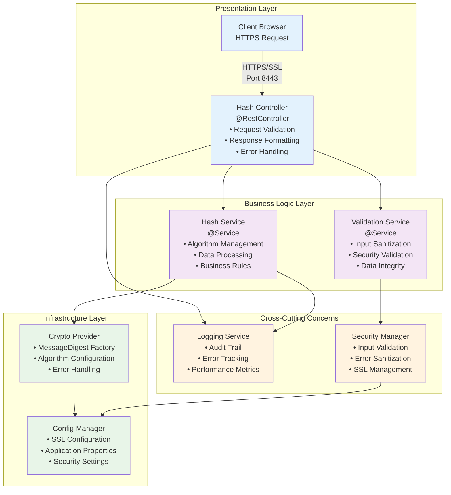
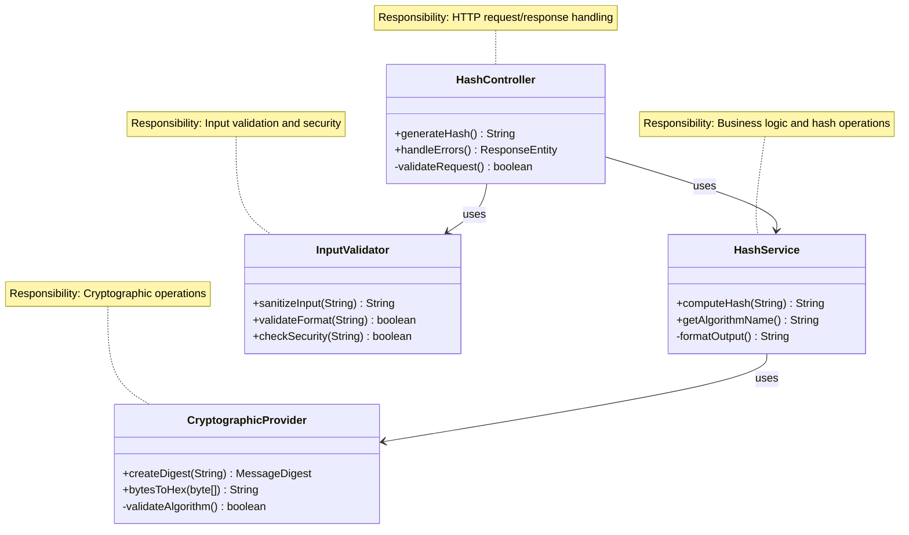
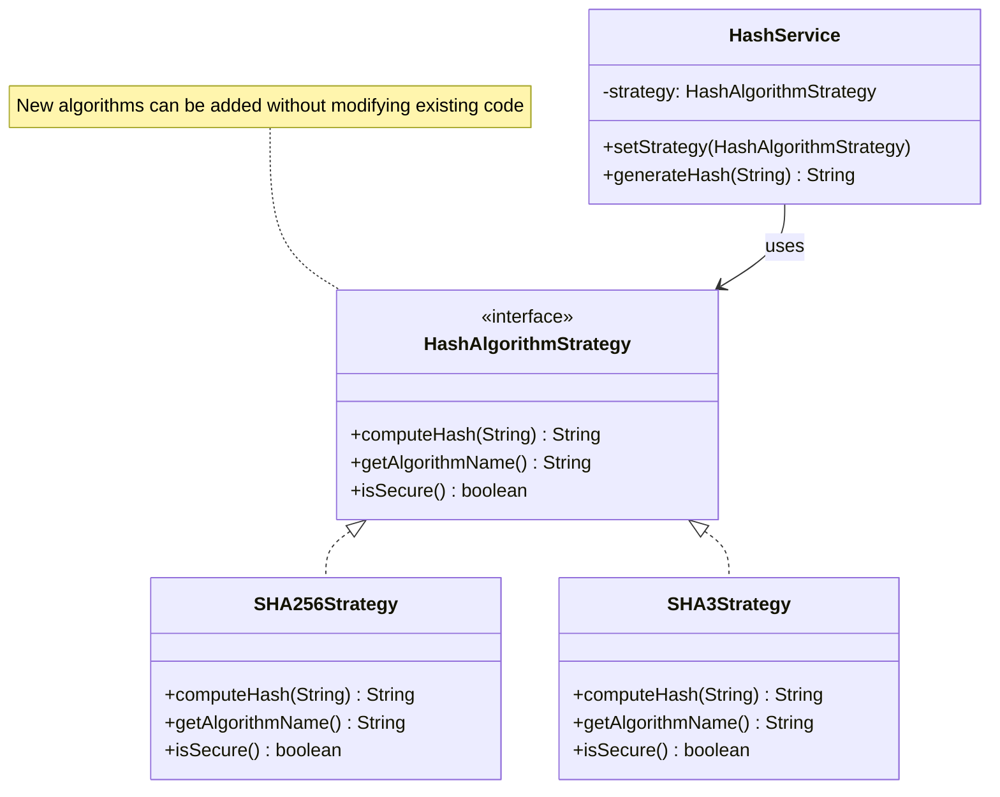
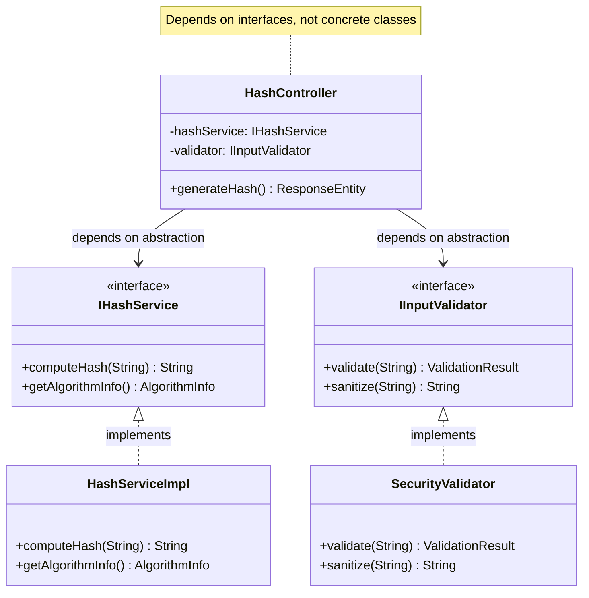
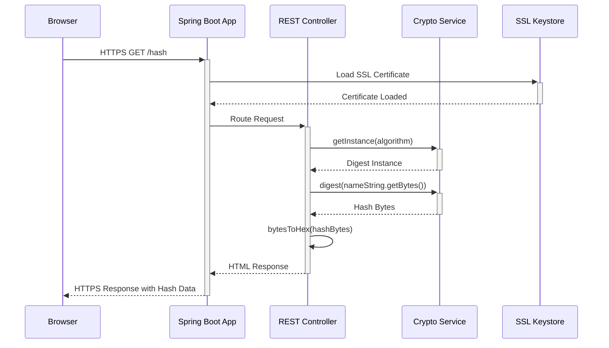
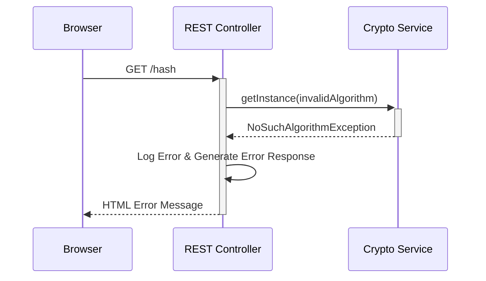
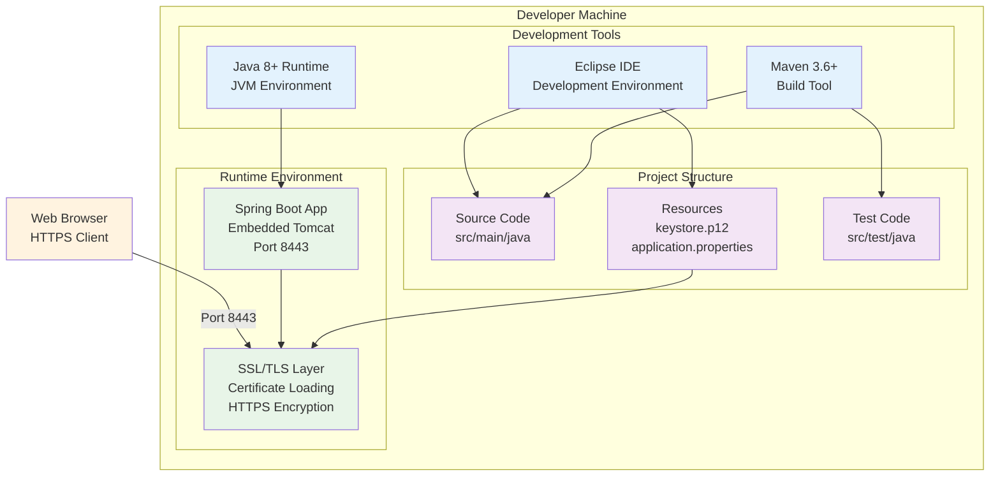
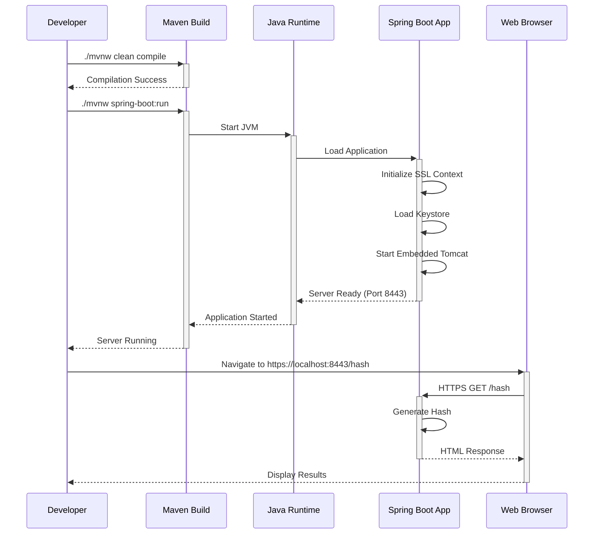

# CS305 Checksum Verification System - Technical Design

## Architecture Overview

The checksum verification system is built as a Spring Boot web application following clean architecture principles with clear separation of concerns. The design implements SOLID principles, secure coding practices, and maintainable patterns.



## SOLID Principles Implementation

### Single Responsibility Principle (SRP)
Each class has a single, well-defined responsibility:



### Open/Closed Principle (OCP)
Design is open for extension, closed for modification:



### Dependency Inversion Principle (DIP)
High-level modules depend on abstractions:



## Design Patterns Implementation

### Strategy Pattern for Hash Algorithms
```java
/**
 * Strategy interface for different hash algorithms
 * Enables easy addition of new algorithms without code modification
 */
public interface HashAlgorithmStrategy {
    /**
     * Computes hash for given input
     * @param input The string to hash
     * @return Hexadecimal representation of hash
     * @throws SecurityException if algorithm is compromised
     */
    String computeHash(String input) throws SecurityException;
    
    /**
     * @return Algorithm name for display purposes
     */
    String getAlgorithmName();
    
    /**
     * @return true if algorithm meets current security standards
     */
    boolean isSecure();
}
```

### Factory Pattern for Algorithm Creation
```java
/**
 * Factory for creating hash algorithm strategies
 * Centralizes algorithm selection and validation logic
 */
@Component
public class HashAlgorithmFactory {
    
    private static final Set<String> SECURE_ALGORITHMS = 
        Set.of("SHA-256", "SHA-3-256", "SHA-512", "SHA-3-512");
    
    /**
     * Creates appropriate hash strategy based on algorithm name
     * @param algorithmName Name of the hash algorithm
     * @return HashAlgorithmStrategy implementation
     * @throws IllegalArgumentException if algorithm is not secure
     */
    public HashAlgorithmStrategy createStrategy(String algorithmName) {
        validateAlgorithmSecurity(algorithmName);
        
        return switch (algorithmName.toUpperCase()) {
            case "SHA-256" -> new SHA256Strategy();
            case "SHA-3-256" -> new SHA3_256Strategy();
            case "SHA-512" -> new SHA512Strategy();
            case "SHA-3-512" -> new SHA3_512Strategy();
            default -> throw new IllegalArgumentException(
                "Unsupported algorithm: " + algorithmName);
        };
    }
    
    private void validateAlgorithmSecurity(String algorithm) {
        if (!SECURE_ALGORITHMS.contains(algorithm)) {
            throw new SecurityException(
                "Algorithm " + algorithm + " does not meet security requirements");
        }
    }
}
```

### Template Method Pattern for Hash Processing
```java
/**
 * Abstract base class defining hash processing template
 * Ensures consistent processing flow while allowing algorithm-specific customization
 */
public abstract class AbstractHashProcessor {
    
    /**
     * Template method defining the hash processing workflow
     * @param input Input string to process
     * @return ProcessedHashResult containing all necessary information
     */
    public final ProcessedHashResult processHash(String input) {
        // Step 1: Validate and sanitize input
        String sanitizedInput = validateAndSanitizeInput(input);
        
        // Step 2: Compute hash (algorithm-specific)
        byte[] hashBytes = computeHashBytes(sanitizedInput);
        
        // Step 3: Convert to hex representation
        String hexHash = bytesToHex(hashBytes);
        
        // Step 4: Create result object
        return createResult(sanitizedInput, hexHash, getAlgorithmName());
    }
    
    // Template methods for subclasses to implement
    protected abstract byte[] computeHashBytes(String input);
    protected abstract String getAlgorithmName();
    
    // Common implementation methods
    private String validateAndSanitizeInput(String input) {
        if (input == null || input.trim().isEmpty()) {
            throw new IllegalArgumentException("Input cannot be null or empty");
        }
        return input.trim();
    }
    
    private String bytesToHex(byte[] bytes) {
        StringBuilder result = new StringBuilder();
        for (byte b : bytes) {
            result.append(String.format("%02x", b));
        }
        return result.toString();
    }
}
```

### 1. Spring Boot Application Core

**Class**: `ServerApplication`
- **Purpose**: Main application entry point and embedded REST controller
- **Responsibilities**:
  - Application bootstrapping via `@SpringBootApplication`
  - HTTP request handling via `@RestController`
  - SSL configuration management
  - Dependency injection coordination

### 2. SSL/TLS Security Layer

**Configuration**: `application.properties`
```properties
server.port=8443
server.ssl.key-alias=tomcat
server.ssl.key-store-password=snhu4321
server.ssl.key-store=classpath:keystore.p12
server.ssl.key-store-type=PKCS12
```

**Components**:
- **PKCS12 Keystore**: Contains self-signed certificate for development
- **SSL Configuration**: Spring Boot auto-configuration for HTTPS
- **Certificate Management**: Automatic certificate loading and validation

### 3. REST Endpoint Design

**Endpoint**: `GET /hash`
**Response Format**: HTML with structured data display

```java
@RequestMapping("/hash")
public String generateChecksum() {
    // Implementation returns HTML containing:
    // - Original data string (student name)
    // - Selected algorithm name
    // - Generated hexadecimal hash value
}
```

## Code Quality and Documentation Standards

### Javadoc Documentation Standards

```java
/**
 * Service responsible for secure hash generation and validation.
 * 
 * <p>This service implements industry-standard cryptographic hash functions
 * with built-in security validation to prevent the use of compromised algorithms.
 * All operations are designed to be thread-safe and performant.</p>
 * 
 * <p><strong>Security Note:</strong> This service automatically rejects 
 * deprecated algorithms (MD5, SHA-1) and enforces current security standards.</p>
 * 
 * @author CS305 Student
 * @version 1.0
 * @since 1.0
 * @see HashAlgorithmStrategy
 * @see CryptographicProvider
 */
@Service
@Slf4j
public class HashService implements IHashService {
    
    /**
     * Computes cryptographic hash for the given input string.
     * 
     * <p>This method performs the following operations:</p>
     * <ol>
     *   <li>Validates input for security compliance</li>
     *   <li>Applies selected hash algorithm</li>
     *   <li>Converts result to hexadecimal representation</li>
     *   <li>Logs operation for audit purposes</li>
     * </ol>
     * 
     * @param input the string to be hashed; must not be null or empty
     * @param algorithmName the name of the hash algorithm to use
     * @return hexadecimal representation of the computed hash
     * @throws IllegalArgumentException if input is null, empty, or invalid
     * @throws SecurityException if the specified algorithm is not secure
     * @throws CryptographicException if hash computation fails
     * @throws RuntimeException if an unexpected error occurs
     * 
     * @implNote This method uses UTF-8 encoding for string-to-byte conversion
     *           to ensure consistent results across different platforms.
     * 
     * @example
     * <pre>{@code
     * HashService service = new HashService();
     * String result = service.computeHash("John Doe", "SHA-256");
     * // Returns: "a665a45920422f9d417e4867efdc4fb8a04a1f3fff1fa07e998e86f7f7a27ae3"
     * }</pre>
     */
    @Override
    public String computeHash(@NonNull String input, @NonNull String algorithmName) 
            throws SecurityException, CryptographicException {
        // Implementation details...
    }
}
```

### Code Formatting and Style Standards

```java
/**
 * Example of proper formatting and naming conventions
 */
@RestController
@RequestMapping("/api/v1/hash")
@Validated
@Slf4j
public class HashController {
    
    // Constants use UPPER_SNAKE_CASE
    private static final String DEFAULT_ALGORITHM = "SHA-256";
    private static final int MAX_INPUT_LENGTH = 1000;
    private static final String CONTENT_TYPE_HTML = "text/html;charset=UTF-8";
    
    // Dependencies injected via constructor (immutable)
    private final IHashService hashService;
    private final IInputValidator inputValidator;
    private final IResponseFormatter responseFormatter;
    
    /**
     * Constructor for dependency injection.
     * All dependencies are required and validated at construction time.
     */
    public HashController(
            @NonNull IHashService hashService,
            @NonNull IInputValidator inputValidator, 
            @NonNull IResponseFormatter responseFormatter) {
        this.hashService = Objects.requireNonNull(hashService, "Hash service cannot be null");
        this.inputValidator = Objects.requireNonNull(inputValidator, "Input validator cannot be null");
        this.responseFormatter = Objects.requireNonNull(responseFormatter, "Response formatter cannot be null");
    }
    
    /**
     * Generates hash for student name with comprehensive error handling.
     */
    @GetMapping(produces = CONTENT_TYPE_HTML)
    public ResponseEntity<String> generateHashForStudentName() {
        try {
            // Step 1: Get and validate student data
            String studentName = getStudentNameFromConfig();
            ValidationResult validationResult = inputValidator.validate(studentName);
            
            if (!validationResult.isValid()) {
                log.warn("Invalid input detected: {}", validationResult.getErrorMessage());
                return createErrorResponse(HttpStatus.BAD_REQUEST, "Invalid input format");
            }
            
            // Step 2: Generate hash with selected algorithm
            String hashResult = hashService.computeHash(studentName, DEFAULT_ALGORITHM);
            
            // Step 3: Format response for display
            String htmlResponse = responseFormatter.formatHashResponse(
                studentName, DEFAULT_ALGORITHM, hashResult);
            
            // Step 4: Log successful operation (without sensitive data)
            log.info("Hash generated successfully for input length: {}", studentName.length());
            
            return ResponseEntity.ok()
                .contentType(MediaType.TEXT_HTML)
                .body(htmlResponse);
                
        } catch (SecurityException secEx) {
            log.error("Security violation during hash generation", secEx);
            return createErrorResponse(HttpStatus.FORBIDDEN, "Security policy violation");
            
        } catch (CryptographicException cryptoEx) {
            log.error("Cryptographic operation failed", cryptoEx);
            return createErrorResponse(HttpStatus.INTERNAL_SERVER_ERROR, "Hash generation failed");
            
        } catch (Exception unexpectedEx) {
            log.error("Unexpected error during hash generation", unexpectedEx);
            return createErrorResponse(HttpStatus.INTERNAL_SERVER_ERROR, "An unexpected error occurred");
        }
    }
    
    /**
     * Creates standardized error response without exposing sensitive information.
     */
    private ResponseEntity<String> createErrorResponse(HttpStatus status, String userMessage) {
        String errorHtml = responseFormatter.formatErrorResponse(userMessage);
        return ResponseEntity.status(status)
            .contentType(MediaType.TEXT_HTML)
            .body(errorHtml);
    }
}
```

### Data Structure Optimization Patterns

```java
/**
 * Optimized utility class for cryptographic operations.
 * Uses efficient data structures and memory management.
 */
@UtilityClass
public final class CryptographicUtils {
    
    // Pre-computed hex lookup table for performance optimization
    private static final char[] HEX_CHARS = {
        '0', '1', '2', '3', '4', '5', '6', '7',
        '8', '9', 'a', 'b', 'c', 'd', 'e', 'f'
    };
    
    // Thread-safe algorithm cache to avoid repeated MessageDigest creation
    private static final ConcurrentHashMap<String, Supplier<MessageDigest>> ALGORITHM_CACHE = 
        new ConcurrentHashMap<>();
    
    /**
     * Converts byte array to hexadecimal string with optimal performance.
     * Uses pre-computed lookup table and StringBuilder for efficiency.
     * 
     * @param bytes input byte array
     * @return hexadecimal string representation
     * @throws IllegalArgumentException if bytes is null
     */
    public static String bytesToHex(@NonNull byte[] bytes) {
        if (bytes.length == 0) {
            return "";
        }
        
        // Pre-size StringBuilder to exact capacity needed
        StringBuilder hexString = new StringBuilder(bytes.length * 2);
        
        // Use bit operations for optimal performance
        for (byte b : bytes) {
            int unsigned = b & 0xFF;
            hexString.append(HEX_CHARS[unsigned >>> 4])    // High nibble
                     .append(HEX_CHARS[unsigned & 0x0F]);  // Low nibble
        }
        
        return hexString.toString();
    }
    
    /**
     * Creates MessageDigest instance with caching for performance.
     * Thread-safe implementation using supplier pattern.
     */
    public static MessageDigest createDigest(String algorithm) throws NoSuchAlgorithmException {
        return ALGORITHM_CACHE.computeIfAbsent(algorithm, alg -> () -> {
            try {
                return MessageDigest.getInstance(alg);
            } catch (NoSuchAlgorithmException e) {
                throw new IllegalArgumentException("Algorithm not supported: " + alg, e);
            }
        }).get();
    }
    
    /**
     * Secure string-to-bytes conversion with explicit encoding.
     * Prevents platform-dependent encoding issues.
     */
    public static byte[] stringToBytes(@NonNull String input) {
        return input.getBytes(StandardCharsets.UTF_8);
    }
    
    /**
     * Clears sensitive byte arrays after use (security best practice).
     * Overwrites memory to prevent data recovery.
     */
    public static void clearSensitiveData(@NonNull byte[] sensitiveData) {
        Arrays.fill(sensitiveData, (byte) 0);
    }
}
```

## Security Implementation Patterns

### Secure Error Handling Pattern

```java
/**
 * Security-focused error handling that prevents information leakage.
 */
@Component
@Slf4j
public class SecureErrorHandler {
    
    // Generic error messages for external users (no technical details)
    private static final Map<Class<? extends Exception>, String> USER_ERROR_MESSAGES = Map.of(
        SecurityException.class, "Access denied due to security policy",
        IllegalArgumentException.class, "Invalid request parameters",
        CryptographicException.class, "Processing request failed",
        RuntimeException.class, "An unexpected error occurred"
    );
    
    /**
     * Handles exceptions securely by logging technical details internally
     * while providing safe, generic messages to external users.
     */
    public ErrorResponse handleSecurely(Exception exception, String operationContext) {
        // Log full technical details for developers (internal only)
        String errorId = UUID.randomUUID().toString();
        log.error("Error ID [{}] in operation [{}]: {}", 
            errorId, operationContext, exception.getMessage(), exception);
        
        // Determine safe user message (no technical details exposed)
        String userMessage = USER_ERROR_MESSAGES.getOrDefault(
            exception.getClass(), "An error occurred while processing your request");
        
        // Return sanitized error response
        return ErrorResponse.builder()
            .errorId(errorId)              // For support reference
            .userMessage(userMessage)      // Safe for external display
            .timestamp(Instant.now())
            .operation(operationContext)
            .build();
    }
}
```

### Input Validation and Sanitization Pattern

```java
/**
 * Comprehensive input validation following security best practices.
 */
@Component
@Slf4j
public class SecurityInputValidator implements IInputValidator {
    
    // Security constraints
    private static final int MAX_INPUT_LENGTH = 1000;
    private static final int MIN_INPUT_LENGTH = 1;
    private static final Pattern ALLOWED_CHARACTERS = Pattern.compile("^[a-zA-Z0-9\\s\\-_\\.]+$");
    private static final Pattern SQL_INJECTION_PATTERN = Pattern.compile(
        "(?i)(union|select|insert|update|delete|drop|create|alter|exec|script)");
    
    @Override
    public ValidationResult validate(@NonNull String input) {
        try {
            // Step 1: Basic null and length checks
            if (StringUtils.isBlank(input)) {
                return ValidationResult.invalid("Input cannot be empty");
            }
            
            if (input.length() > MAX_INPUT_LENGTH) {
                return ValidationResult.invalid("Input exceeds maximum length");
            }
            
            if (input.length() < MIN_INPUT_LENGTH) {
                return ValidationResult.invalid("Input below minimum length");
            }
            
            // Step 2: Character set validation
            if (!ALLOWED_CHARACTERS.matcher(input).matches()) {
                log.warn("Invalid characters detected in input");
                return ValidationResult.invalid("Input contains invalid characters");
            }
            
            // Step 3: Security threat detection
            if (SQL_INJECTION_PATTERN.matcher(input).find()) {
                log.warn("Potential SQL injection attempt detected");
                return ValidationResult.invalid("Input contains prohibited content");
            }
            
            // Step 4: Business logic validation (name format)
            if (!isValidNameFormat(input)) {
                return ValidationResult.invalid("Input does not match expected name format");
            }
            
            return ValidationResult.valid();
            
        } catch (Exception e) {
            log.error("Validation process failed for input", e);
            return ValidationResult.invalid("Validation process failed");
        }
    }
    
    @Override
    public String sanitize(@NonNull String input) {
        return input.trim()                    // Remove leading/trailing whitespace
                   .replaceAll("\\s+", " ")    // Normalize multiple spaces
                   .toLowerCase();             // Normalize case for consistency
    }
    
    private boolean isValidNameFormat(String input) {
        String[] parts = input.trim().split("\\s+");
        return parts.length >= 2 && parts.length <= 4; // First name + Last name (+ optional middle/suffix)
    }
}
```

### 5. Data Processing Pipeline

```mermaid
flowchart LR
    subgraph "Input Stage"
        A[Student Name Input<br/>Rick Smith]
    end
    
    subgraph "Encoding Stage"
        B[UTF-8 Encoding<br/>String → byte[]]
    end
    
    subgraph "Cryptographic Stage"
        C[Hash Generation<br/>MessageDigest.digest]
    end
    
    subgraph "Formatting Stage"
        D[Hex Conversion<br/>byte[] → String]
    end
    
    subgraph "Response Stage"
        E[HTML Response<br/>Formatted Output]
    end
    
    A --> B
    B --> C
    C --> D
    D --> E
    
    classDef inputStyle fill:#e1f5fe
    classDef processStyle fill:#f3e5f5
    classDef outputStyle fill:#e8f5e8
    
    class A inputStyle
    class B,C,D processStyle
    class E outputStyle
```

**Processing Steps**:
1. **Input Preparation**: Format student name as "FirstName LastName"
2. **Encoding**: Convert string to byte array using UTF-8
3. **Hash Calculation**: Apply selected cryptographic algorithm
4. **Format Conversion**: Convert hash bytes to hexadecimal string
5. **Response Generation**: Format results as HTML for browser display

## Sequence Diagrams

### Primary Hash Generation Flow



### Error Handling Flow



## Security Considerations

### 1. Cryptographic Algorithm Security

**Selection Criteria**:
- **Collision Resistance**: Computationally infeasible to find two inputs with same hash
- **Preimage Resistance**: Difficult to find input that produces specific hash
- **Second Preimage Resistance**: Hard to find different input with same hash as given input

**Implementation Security**:
```java
// Secure implementation pattern
try {
    MessageDigest digest = MessageDigest.getInstance("SHA-256");
    byte[] hashBytes = digest.digest(data.getBytes(StandardCharsets.UTF_8));
    return bytesToHex(hashBytes);
} catch (NoSuchAlgorithmException e) {
    // Proper error handling without information leakage
    logger.error("Hash algorithm not available", e);
    return "Error: Unable to generate hash";
}
```

### 2. SSL/TLS Security

**Certificate Management**:
- Self-signed certificate acceptable for educational use
- Production systems require CA-signed certificates
- Private key protection via keystore password

**Protocol Security**:
- TLS 1.2+ protocols only
- Strong cipher suites
- Certificate validation

### 3. Input Validation and Sanitization

**Data Handling**:
```java
// Secure string processing
String studentName = validateAndSanitizeInput(rawInput);
byte[] inputBytes = studentName.getBytes(StandardCharsets.UTF_8);
```

**Validation Rules**:
- Input length limits
- Character set restrictions
- Encoding normalization

## Implementation Considerations

### 1. Maven Dependencies

**Required Dependencies**:
```xml
<dependencies>
    <dependency>
        <groupId>org.springframework.boot</groupId>
        <artifactId>spring-boot-starter-web</artifactId>
        <version>2.2.4.RELEASE</version>
    </dependency>
    <dependency>
        <groupId>org.springframework.boot</groupId>
        <artifactId>spring-boot-starter-data-rest</artifactId>
    </dependency>
</dependencies>
```

### 2. Configuration Management

**Spring Boot Configuration**:
- SSL properties in `application.properties`
- Keystore location as classpath resource
- Port and security settings centralized

### 3. Error Handling Strategy

**Exception Handling**:
```java
// Comprehensive error handling
try {
    // Cryptographic operations
} catch (NoSuchAlgorithmException e) {
    // Algorithm not available
} catch (UnsupportedEncodingException e) {
    // Character encoding issues
} catch (Exception e) {
    // Unexpected errors
}
```

### 4. Testing Strategy

**Unit Testing Areas**:
- Hash generation correctness
- Hex conversion accuracy
- Error handling robustness
- SSL configuration validation

**Integration Testing**:
- End-to-end HTTPS request/response
- Certificate loading and validation
- Application startup and shutdown

## Performance Considerations

### 1. Hash Algorithm Performance

**Performance Characteristics**:
- **SHA-256**: Fast, widely optimized
- **SHA-3-256**: Newer, potentially slower
- **SHA-512**: Higher computational cost
- **Memory usage**: Minimal for single hash operations

### 2. Web Server Performance

**Spring Boot Optimization**:
- Embedded Tomcat for simplicity
- Default thread pool adequate for educational use
- SSL handshake overhead acceptable for low-volume testing

### 3. Scalability Considerations

**Current Scope**: Single-user educational application
**Future Enhancements**: Connection pooling, caching, load balancing for production use

## Deployment Architecture

### 1. Development Environment



### 2. Build and Execution Flow



## Integration Points

### 1. External Dependencies

**Oracle Java Security**:
- Standard algorithm names compliance
- JCE (Java Cryptography Extension) provider
- Security policy adherence

**Spring Boot Framework**:
- Auto-configuration for SSL
- Embedded web server management
- Dependency injection container

### 2. Browser Compatibility

**HTTPS Requirements**:
- TLS 1.2+ support
- Self-signed certificate acceptance
- HTML5 rendering capabilities

## Documentation Integration

### 1. Code Documentation

**Inline Documentation**:
```java
/**
 * Generates cryptographic hash for student name verification
 * @param studentName The student's first and last name
 * @return Hexadecimal representation of hash value
 * @throws NoSuchAlgorithmException if selected algorithm unavailable
 */
public String generateHash(String studentName) { ... }
```

### 2. Academic Documentation

**Assignment Deliverables**:
- Source code with comments
- Algorithm justification document
- Browser screenshot evidence
- APA format citations

## Future Enhancements

### 1. Security Improvements

**Production Readiness**:
- CA-signed certificates
- Advanced SSL configuration
- Input validation frameworks
- Audit logging capabilities

### 2. Functional Extensions

**Enhanced Features**:
- Multiple hash algorithm support
- File upload and verification
- Batch processing capabilities
- RESTful API expansion

### 3. Monitoring and Observability

**Operational Features**:
- Health check endpoints
- Metrics collection
- Error tracking and alerting
- Performance monitoring