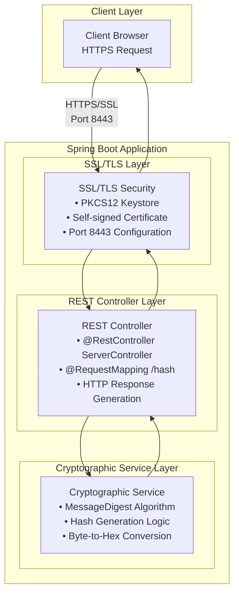
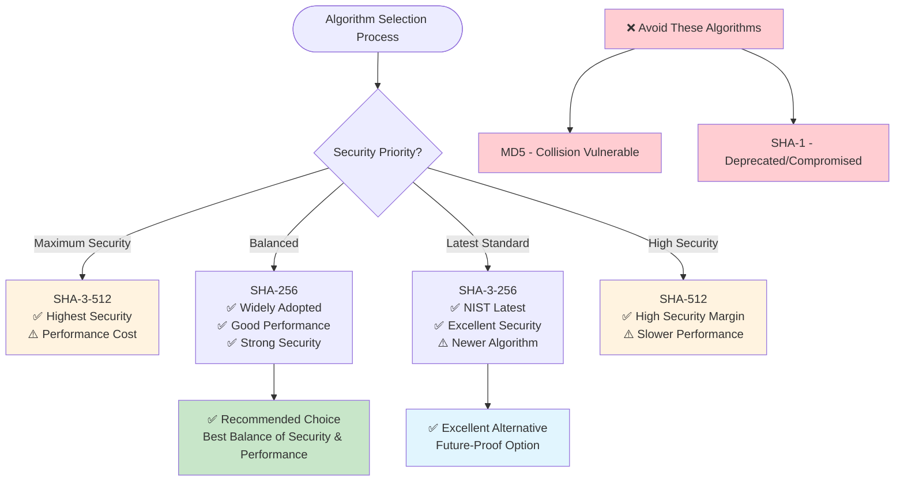
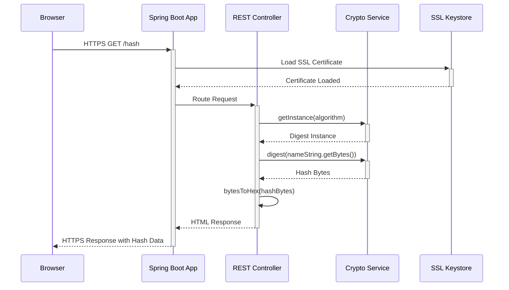
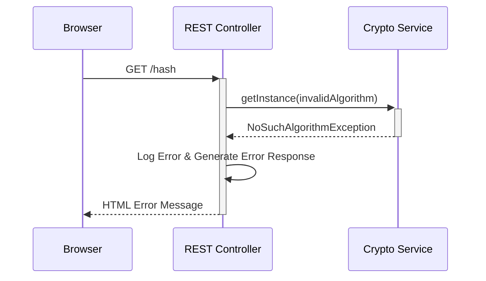
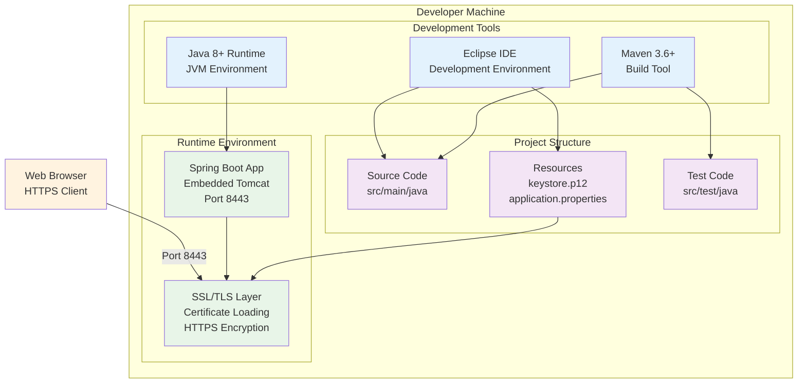
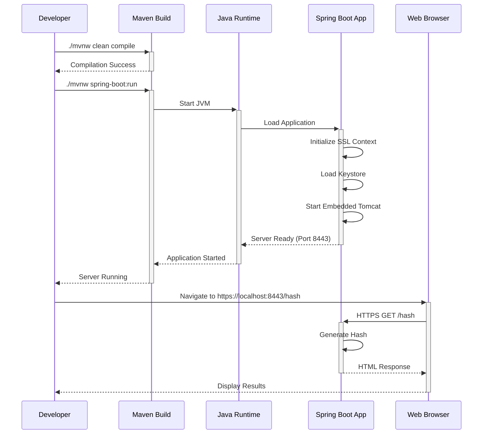

# CS305 Checksum Verification System - Technical Design

## Architecture Overview

The checksum verification system is built as a Spring Boot web application with SSL/TLS encryption, implementing cryptographic hash functions for data integrity verification. The architecture follows a simple MVC pattern with embedded REST controller functionality.



## Component Design

### System Component Overview

```mermaid
graph TB
    subgraph "Application Layer"
        App[ServerApplication<br/>@SpringBootApplication<br/>• Bootstrap Configuration<br/>• Dependency Injection]
    end
    
    subgraph "Web Layer"
        Controller[ServerController<br/>@RestController<br/>• HTTP Request Handling<br/>• Response Generation]
    end
    
    subgraph "Security Layer"
        SSL[SSL Configuration<br/>• PKCS12 Keystore<br/>• Certificate Management]
        Hash[Hash Service<br/>• Algorithm Selection<br/>• Cryptographic Operations]
    end
    
    subgraph "Infrastructure Layer"
        Config[application.properties<br/>• SSL Settings<br/>• Port Configuration]
        Keystore[keystore.p12<br/>• Self-signed Certificate<br/>• Private Key Storage]
    end
    
    App --> Controller
    Controller --> Hash
    Controller --> SSL
    SSL --> Config
    SSL --> Keystore
    Hash --> Config
    
    classDef appLayer fill:#e3f2fd
    classDef webLayer fill:#f3e5f5
    classDef secLayer fill:#fff3e0
    classDef infraLayer fill:#e8f5e8
    
    class App appLayer
    class Controller webLayer
    class SSL,Hash secLayer
    class Config,Keystore infraLayer
```

### 1. Spring Boot Application Core

**Class**: `ServerApplication`
- **Purpose**: Main application entry point and embedded REST controller
- **Responsibilities**:
  - Application bootstrapping via `@SpringBootApplication`
  - HTTP request handling via `@RestController`
  - SSL configuration management
  - Dependency injection coordination

### 2. SSL/TLS Security Layer

**Configuration**: `application.properties`
```properties
server.port=8443
server.ssl.key-alias=tomcat
server.ssl.key-store-password=snhu4321
server.ssl.key-store=classpath:keystore.p12
server.ssl.key-store-type=PKCS12
```

**Components**:
- **PKCS12 Keystore**: Contains self-signed certificate for development
- **SSL Configuration**: Spring Boot auto-configuration for HTTPS
- **Certificate Management**: Automatic certificate loading and validation

### 3. REST Endpoint Design

**Endpoint**: `GET /hash`
**Response Format**: HTML with structured data display

```java
@RequestMapping("/hash")
public String generateChecksum() {
    // Implementation returns HTML containing:
    // - Original data string (student name)
    // - Selected algorithm name
    // - Generated hexadecimal hash value
}
```

### 4. Cryptographic Hash Service

**Core Algorithm Selection Process**:

```java
// Algorithm evaluation criteria:
// 1. Collision resistance strength
// 2. Current security standards compliance
// 3. Java standard library availability
// 4. Performance characteristics

MessageDigest digest = MessageDigest.getInstance("SHA-256"); // Example selection
```



**Algorithm Selection Rationale**:
- **Primary Choice**: SHA-256 for optimal balance of security and performance
- **Alternative**: SHA-3-256 for latest NIST standards compliance
- **Avoid**: MD5 and SHA-1 due to known vulnerabilities

### 5. Data Processing Pipeline

```mermaid
flowchart LR
    subgraph "Input Stage"
        A[Student Name Input<br/>Rick Smith]
    end
    
    subgraph "Encoding Stage"
        B[UTF-8 Encoding<br/>String → byte[]]
    end
    
    subgraph "Cryptographic Stage"
        C[Hash Generation<br/>MessageDigest.digest]
    end
    
    subgraph "Formatting Stage"
        D[Hex Conversion<br/>byte[] → String]
    end
    
    subgraph "Response Stage"
        E[HTML Response<br/>Formatted Output]
    end
    
    A --> B
    B --> C
    C --> D
    D --> E
    
    classDef inputStyle fill:#e1f5fe
    classDef processStyle fill:#f3e5f5
    classDef outputStyle fill:#e8f5e8
    
    class A inputStyle
    class B,C,D processStyle
    class E outputStyle
```

**Processing Steps**:
1. **Input Preparation**: Format student name as "FirstName LastName"
2. **Encoding**: Convert string to byte array using UTF-8
3. **Hash Calculation**: Apply selected cryptographic algorithm
4. **Format Conversion**: Convert hash bytes to hexadecimal string
5. **Response Generation**: Format results as HTML for browser display

## Sequence Diagrams

### Primary Hash Generation Flow



### Error Handling Flow



## Security Considerations

### 1. Cryptographic Algorithm Security

**Selection Criteria**:
- **Collision Resistance**: Computationally infeasible to find two inputs with same hash
- **Preimage Resistance**: Difficult to find input that produces specific hash
- **Second Preimage Resistance**: Hard to find different input with same hash as given input

**Implementation Security**:
```java
// Secure implementation pattern
try {
    MessageDigest digest = MessageDigest.getInstance("SHA-256");
    byte[] hashBytes = digest.digest(data.getBytes(StandardCharsets.UTF_8));
    return bytesToHex(hashBytes);
} catch (NoSuchAlgorithmException e) {
    // Proper error handling without information leakage
    logger.error("Hash algorithm not available", e);
    return "Error: Unable to generate hash";
}
```

### 2. SSL/TLS Security

**Certificate Management**:
- Self-signed certificate acceptable for educational use
- Production systems require CA-signed certificates
- Private key protection via keystore password

**Protocol Security**:
- TLS 1.2+ protocols only
- Strong cipher suites
- Certificate validation

### 3. Input Validation and Sanitization

**Data Handling**:
```java
// Secure string processing
String studentName = validateAndSanitizeInput(rawInput);
byte[] inputBytes = studentName.getBytes(StandardCharsets.UTF_8);
```

**Validation Rules**:
- Input length limits
- Character set restrictions
- Encoding normalization

## Implementation Considerations

### 1. Maven Dependencies

**Required Dependencies**:
```xml
<dependencies>
    <dependency>
        <groupId>org.springframework.boot</groupId>
        <artifactId>spring-boot-starter-web</artifactId>
        <version>2.2.4.RELEASE</version>
    </dependency>
    <dependency>
        <groupId>org.springframework.boot</groupId>
        <artifactId>spring-boot-starter-data-rest</artifactId>
    </dependency>
</dependencies>
```

### 2. Configuration Management

**Spring Boot Configuration**:
- SSL properties in `application.properties`
- Keystore location as classpath resource
- Port and security settings centralized

### 3. Error Handling Strategy

**Exception Handling**:
```java
// Comprehensive error handling
try {
    // Cryptographic operations
} catch (NoSuchAlgorithmException e) {
    // Algorithm not available
} catch (UnsupportedEncodingException e) {
    // Character encoding issues
} catch (Exception e) {
    // Unexpected errors
}
```

### 4. Testing Strategy

**Unit Testing Areas**:
- Hash generation correctness
- Hex conversion accuracy
- Error handling robustness
- SSL configuration validation

**Integration Testing**:
- End-to-end HTTPS request/response
- Certificate loading and validation
- Application startup and shutdown

## Performance Considerations

### 1. Hash Algorithm Performance

**Performance Characteristics**:
- **SHA-256**: Fast, widely optimized
- **SHA-3-256**: Newer, potentially slower
- **SHA-512**: Higher computational cost
- **Memory usage**: Minimal for single hash operations

### 2. Web Server Performance

**Spring Boot Optimization**:
- Embedded Tomcat for simplicity
- Default thread pool adequate for educational use
- SSL handshake overhead acceptable for low-volume testing

### 3. Scalability Considerations

**Current Scope**: Single-user educational application
**Future Enhancements**: Connection pooling, caching, load balancing for production use

## Deployment Architecture

### 1. Development Environment



### 2. Build and Execution Flow



## Integration Points

### 1. External Dependencies

**Oracle Java Security**:
- Standard algorithm names compliance
- JCE (Java Cryptography Extension) provider
- Security policy adherence

**Spring Boot Framework**:
- Auto-configuration for SSL
- Embedded web server management
- Dependency injection container

### 2. Browser Compatibility

**HTTPS Requirements**:
- TLS 1.2+ support
- Self-signed certificate acceptance
- HTML5 rendering capabilities

## Documentation Integration

### 1. Code Documentation

**Inline Documentation**:
```java
/**
 * Generates cryptographic hash for student name verification
 * @param studentName The student's first and last name
 * @return Hexadecimal representation of hash value
 * @throws NoSuchAlgorithmException if selected algorithm unavailable
 */
public String generateHash(String studentName) { ... }
```

### 2. Academic Documentation

**Assignment Deliverables**:
- Source code with comments
- Algorithm justification document
- Browser screenshot evidence
- APA format citations

## Future Enhancements

### 1. Security Improvements

**Production Readiness**:
- CA-signed certificates
- Advanced SSL configuration
- Input validation frameworks
- Audit logging capabilities

### 2. Functional Extensions

**Enhanced Features**:
- Multiple hash algorithm support
- File upload and verification
- Batch processing capabilities
- RESTful API expansion

### 3. Monitoring and Observability

**Operational Features**:
- Health check endpoints
- Metrics collection
- Error tracking and alerting
- Performance monitoring